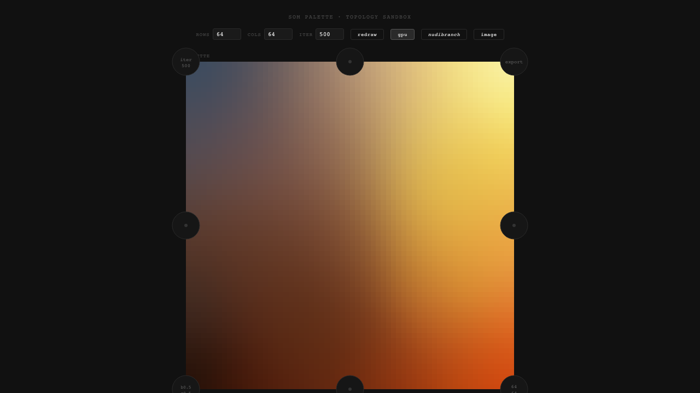

# Palettope

**Extract color palettes by training a self-organizing map over an image — on a chosen topological surface.**



Live demo → **https://palettope.app/**

## What it is

Palettope treats palette extraction as *organization*, not just clustering. It trains a
[self-organizing map](https://en.wikipedia.org/wiki/Self-organizing_map) (SOM) on an image's pixels:
a grid of color "neurons" that each pull toward the colors they see while dragging their neighbors
along, so adjacent cells settle on adjacent colors. Read the trained grid back out and you get a
palette laid out in a smooth, navigable order rather than an arbitrary list.

The twist is the **topology**. The SOM's grid doesn't have to be a flat rectangle — it can wrap into
a cylinder, a torus, a Möbius strip, a Klein bottle, a sphere, and more. Changing the surface changes
how colors neighbor each other and how they tile the space, which changes the palette you get out.

## Modes

- **Extractor** — drop an image, choose a grid size and training schedule, and read off the palette
  (export as PNG or a GIMP `.gpl` file).
- **Topology sandbox** — train the same SOM on different surfaces and watch the organized color field
  form, GPU-accelerated.
- **Graph** — a growing-SOM variant that lays colors out as a force-directed graph, with a
  color-space embedding mode (RGB/OKLab/OKLCh/HSV/HSL) and a "surface" mode that snaps each node onto
  its nearest color on the rendered palette.

## Run it

```bash
npm install
npm run dev
```

Built with Vite + TypeScript. SOM training runs on the GPU via WebGL, with a CPU fallback.

---

Part of [Foldsters](https://foldsters.com).
